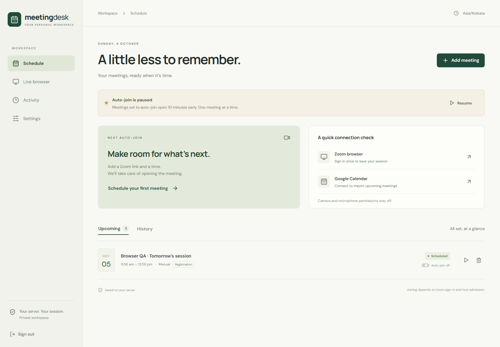
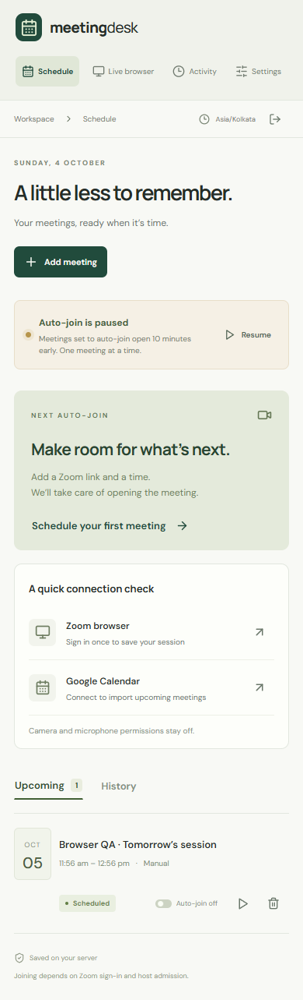

# Meeting Desk

A private, single-owner dashboard that signs into Zoom in a real browser you
control, then joins your fixed weekly sessions on a schedule — including Zoom
**registration** links that need your name and email filled in first.

It is built for one person: you sign in once, the browser session is reused for
every meeting, and a private panel shows exactly what the bot did and whether it
got in. There is no recording, no transcription, and no microphone or camera.

> [!IMPORTANT]
> **Educational use only. Do not misuse this project.**
>
> Meeting Desk is shared as a learning project — to study browser automation,
> scheduling, authentication, and crash-safe storage. Use it **only** to join
> meetings you are personally invited to and allowed to attend, with your own
> account, under the host's and your organization's rules.
>
> Do not use it to join meetings without permission, to evade a host's
> admission controls, to impersonate anyone, to bypass CAPTCHAs or security
> checks, or to attend on someone else's behalf against the meeting's terms.
> Browser automation is an **unofficial** Zoom integration; Zoom's Terms of
> Service and your institution's policies take precedence. You are solely
> responsible for how you use it. The authors provide this code **as-is, with no
> warranty**, and accept no liability for misuse.

## Screenshots

The dashboard is a single private workspace — the overview is where you add a
meeting, watch the next session, and review history. (UI copy evolves between
releases; your build may show slightly different labels.)

| Desktop | Mobile |
|---|---|
|  |  |

## What it does

- **Eight fixed weekly sessions in India Standard Time (Asia/Kolkata).** The
  schedule is materialized 21 days ahead and does not drift with the server's
  UTC clock. The timetable is:

  | Day | Session | IST |
  |---|---|---|
  | Sunday | Sunday session | 17:00 – 19:00 |
  | Monday | Monday session | 18:00 – 20:00 |
  | Tuesday | Tuesday session | 18:00 – 20:00 |
  | Wednesday | Wednesday session | 17:00 – 19:00 |
  | Thursday | Thursday session | 17:00 – 19:00 |
  | Friday | Friday session | 17:00 – 19:00 |
  | Saturday | Saturday morning | 10:00 – 12:00 |
  | Saturday | Saturday afternoon | 14:00 – 16:00 |

- **One-off meetings.** Add an ad-hoc Zoom or registration link with a start and
  end time alongside the weekly schedule (see
  [Add a one-off meeting](#add-a-one-off-meeting-not-in-your-env)). One-off
  meetings are added with auto-join off, so you decide when the bot joins them.
- **Registration-link handling.** The bot opens each meeting up to 15 minutes
  early (default 10), fills the standard registration fields (first name, last
  name, email) from your saved details, and follows visible **Register and
  Join** / **Join from Browser** controls, then monitors admission.
- **No "Open Zoom app?" prompt.** Launcher links (`/j/<id>`, `/w/<id>`) are
  redirected inside the browser to the web client (`app.zoom.us/wc/<id>/join`)
  with `tk`/`pwd` preserved, so Zoom never fires `zoommtg://`. The Docker image
  also blocks Zoom app protocols by Chromium policy. The join form and meeting
  controls are read from inside Zoom's `iframe#webclient`.
- **Sign-in recovery.** If Zoom redirects to `/signin`, the attempt is marked
  needs-attention and an alert is sent once. After you sign in in **Live
  browser**, the bot returns to the meeting's join URL automatically.
- **One meeting at a time.** Overlapping meetings wait for the browser until
  their end time and are then marked missed. The bot leaves at the scheduled
  end.
- **Honest live status.** Each attempt reports joining, waiting for host,
  needs-your-help, confirmed join, stopped, or interrupted — confirmed only
  after real Zoom Leave controls appear. Once a join is confirmed, a reappearing
  CAPTCHA, a hidden toolbar, or a solved challenge never flips the session back
  to "needs attention".
- **Private admin access.** A single super-admin account (Auth.js credentials)
  protects the dashboard and the remote desktop. Sessions are revocable and you
  can change the password in-app.
- **Durable activity log.** Every action is written to a DuckDB activity archive
  through a crash-safe SQLite outbox, so you can review what the bot did.

## Add a one-off meeting (not in your `.env`)

The eight `.env` links only **seed the weekly schedule**. For a meeting that is
not part of that schedule — such as an extra session today — add it from the
dashboard; you do **not** touch `.env`:

1. Open the **Overview** and click **Add test meeting**.
2. Paste the Zoom join or registration link, set a title, and choose today's
   start and end time (IST). Add the display name and a passcode if the meeting
   needs one.
3. Submit. It appears alongside your weekly sessions, tagged **Test / one-off**.
4. A one-off meeting starts with **auto-join off**. To let the bot join it,
   toggle **Auto-join on** in its row, or press **▶ (Join meeting now)** to
   start it immediately.

Links are validated the same way as the weekly ones: they must be HTTPS Zoom
join or registration URLs.

## Poll handling (reminder only, no auto-answer)

Poll automation is **not yet active**. The API reports the poll as
`awaiting_configuration` (it expects to open around 1h45m and be answered around
1h50m into a session). Until auto-answering is wired in, the bot sends an
**urgent ntfy alert at the 1h50m mark** so you can answer it yourself in **Live
browser**, and marks the meeting row "Poll window reached". The reminder fires
once per meeting and only while a join is confirmed. Provide the poll's HTML and
answers to have it wired in.

With `ALERT_NTFY_URL` set you also get a push when a join is confirmed and when
Zoom asks for sign-in or human verification. Every alert carries an **Open
Meeting Desk** button and your dashboard link (`APP_ORIGIN`), never the Zoom
link.

## Limits that matter

Browser automation is an unofficial Zoom integration. Zoom can challenge or
block it, and sign-in can be declined from an automated browser. There is no
guaranteed unattended join, no CAPTCHA bypass, and no workaround for domain
restrictions. Use the live browser to complete verification; hosts still
control admission.

When Zoom shows a visible reCAPTCHA, hCaptcha, Turnstile, or "verify you are
human" page, the bot stops clicking, filling, and reloading on that page, marks
the attempt **Needs attention**, and (if `ALERT_NTFY_URL` is set) sends a push
alert through ntfy, with one reminder after 5 minutes. Solve it in **Live
browser**; the join continues automatically and the solve time is logged. A
challenge you have already ticked is treated as solved. Alerts never include
meeting links. Use an unguessable topic or a self-hosted ntfy server with
`ALERT_NTFY_TOKEN`.

A stored session can expire, and a running browser does **not** prove Zoom
authentication is still valid — access is checked during the meeting flow. Zoom
UI changes or custom registration fields may need manual help. Registration
pages without an editable form are refreshed every 30 seconds; editable forms
are preserved. The app only submits a visible **Register and Join** action, not
arbitrary forms or consent boxes.

After a service restart, interrupted attempts need a manual retry rather than
silently rejoining. Run exactly one replica with its own volume. The browser
profile and the SQLite/DuckDB data contain private meeting information and must
be backed up and protected together.

## Run locally (Node 24+)

1. `npm ci`
2. Copy `.env.example` to `.env` and fill it in:
   - `AUTH_SECRET` — 32+ random characters. Generate with
     `node -e "console.log(require('crypto').randomBytes(32).toString('hex'))"`
   - `ADMIN_PASSWORD` — a unique password of at least 16 characters.
   - `ADMIN_EMAIL`, `ADMIN_NAME` — your super-admin login.
   - `REGISTRATION_FIRST_NAME`, `REGISTRATION_LAST_NAME`, `REGISTRATION_EMAIL` —
     used to fill Zoom registration forms.
   - `MEETING_URL_SUNDAY` … `MEETING_URL_SATURDAY_PM` — the eight weekly
     registration links. These seed the schedule and are editable later in the
     panel.
   - `BROWSER_EXECUTABLE` — your Chrome/Edge/Chromium path (Windows Edge:
     `C:\Program Files (x86)\Microsoft\Edge\Application\msedge.exe`).
3. `npm run build`
4. `npm start` and open `http://localhost:3000`.

For UI development: set `APP_ORIGIN=http://localhost:5173`, run `npm run server`
and `npm run dev`, then open Vite on port 5173. Match the origin exactly with no
trailing slash. Locally the browser opens as a native window; the embedded
noVNC desktop requires the Docker image (`DESKTOP_ENABLED=true`).

The scheduler starts **paused**, so you can sign into Zoom and test a join
before enabling the weekly timetable from Settings.

## Deploy to Dokploy from GitHub (auto-deploy on push)

The app is designed to redeploy automatically whenever you push to `main`.

1. Push this repository to GitHub (see below). The Dokploy API key is **not**
   stored in the repo and is not needed by the running app.
2. In Dokploy, create a **Docker Compose** service pointed at your GitHub
   repository, using the bundled `compose.yml`.
3. Enable Dokploy's GitHub integration / auto-deploy webhook so each push to
   `main` triggers a rebuild.
4. Configure these environment variables in Dokploy:

   ```dotenv
   APP_ORIGIN=https://your-meeting-domain.example
   AUTH_SECRET=<32+ random hex characters>
   ADMIN_PASSWORD=<a unique password of at least 16 characters>
   ADMIN_EMAIL=you@example.com
   ADMIN_NAME=Your Name
   REGISTRATION_FIRST_NAME=Your
   REGISTRATION_LAST_NAME=Name
   REGISTRATION_EMAIL=you@example.com
   MEETING_URL_SUNDAY=https://.../register/...#/registration
   MEETING_URL_MONDAY=...
   MEETING_URL_TUESDAY=...
   MEETING_URL_WEDNESDAY=...
   MEETING_URL_THURSDAY=...
   MEETING_URL_FRIDAY=...
   MEETING_URL_SATURDAY_AM=...
   MEETING_URL_SATURDAY_PM=...
   ```

   Keep `AUTH_SECRET` stable across deployments so existing sessions stay valid.
5. Add your domain in Dokploy, select service **meeting-desk**, container port
   **3000**, path **/**, HTTPS / Let's Encrypt. Point its DNS at your server.
   WebSocket traffic must reach the same service. Only port 3000 is exposed; VNC
   and websockify bind to container loopback and are proxied through the app's
   authenticated routes.

The Docker image installs Chromium, Xvfb, x11vnc, noVNC, websockify and
Fluxbox. Build downloads can take several minutes. Allow roughly 2 CPU cores and
3 GB RAM initially. The named `meeting-data` volume at `/data` persists the
schedule, accounts, activity archive, and browser profile. The container runs in
UTC (`TZ=UTC`); all sessions are still computed in `Asia/Kolkata`.

## Push to GitHub

```bash
git init
git add .
git commit -m "Meeting Desk"
git branch -M main
git remote add origin https://github.com/SamieTheCoder/zoom_bot.git
git push -u origin main
```

`.gitignore` keeps `.env`, the `.local/` folder, the `data/` volume, your
private research notes, and agent session logs out of the repository. The
`docs/screenshots/` images are committed. Confirm `git status` shows none of the
private files before pushing.

## Connect your account and test

1. Sign into the app with `ADMIN_EMAIL` / `ADMIN_PASSWORD`. Change the password
   in Settings.
2. Open **Live browser → Open Zoom sign-in** and complete your Zoom login in
   that browser using your allowed organization account. Click **Done signing
   in** to release the browser for scheduling. This is not a guarantee Zoom will
   accept every meeting.
3. Confirm your participant name and registration first/last name and email in
   Settings. The timezone is fixed to India Standard Time.
4. Test one session you are authorized to join, and verify your identity, the
   registration flow, waiting-room admission, muted media, and leaving.
5. When it looks right, unpause the scheduler in Settings.

## Verification

- `npm test` exercises Zoom URL validation and launcher-to-web-client
  rewriting, scheduling and IST→UTC mapping, encryption, persistent storage,
  browser concurrency, challenge detection and the join-state rules, Auth.js
  authentication and session revocation, cross-origin protection, and the DuckDB
  activity archive. All 20 tests pass.
- `npm run build` produces the production dashboard assets.
- `.github/workflows/ci.yml` runs `npm ci`, `npm test`, and `npm run build` on
  every push to `main` and on pull requests.

Live Zoom admission can only be confirmed after deployment and sign-in; tests
against fixtures cannot guarantee compatibility with a live meeting.

## References

- [Zoom web app and bot protection](https://support.zoom.com/hc/en/article?id=zm_kb&sysparm_article=KB0088381)
- [Auth.js on Express](https://authjs.dev/reference/express)
- [DuckDB Node.js (Neo) client](https://duckdb.org/docs/clients/node_neo/overview)
- [Playwright persistent browser contexts](https://playwright.dev/docs/api/class-browsertype#browser-type-launch-persistent-context)
- [Dokploy Docker Compose domains](https://docs.dokploy.com/docs/core/docker-compose/domains)
